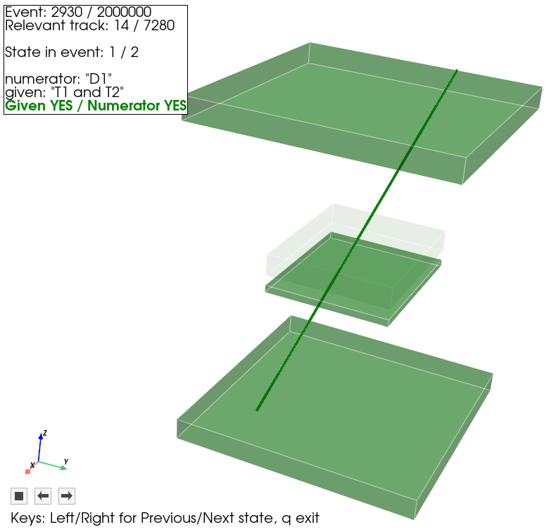
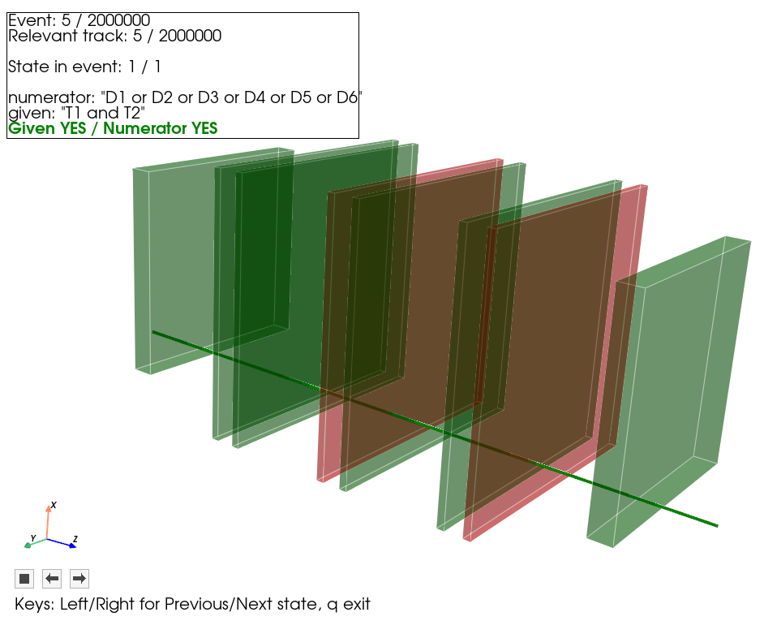
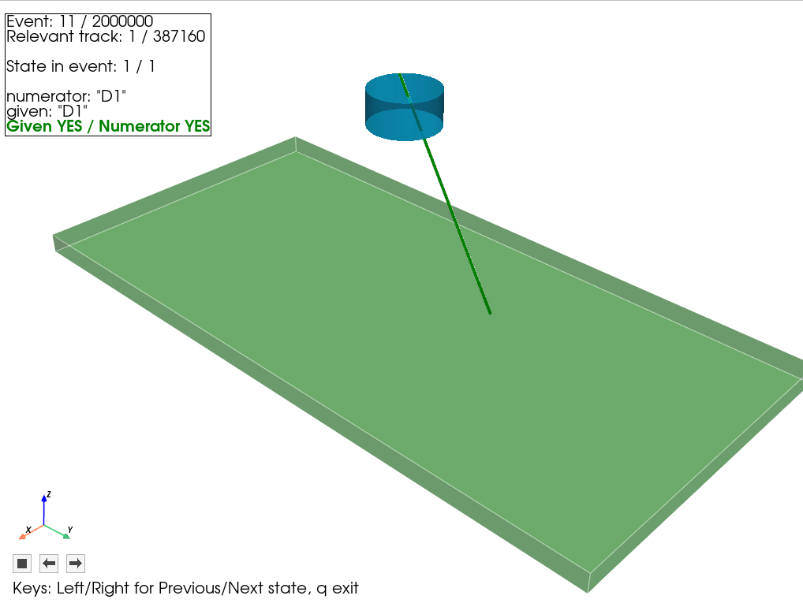
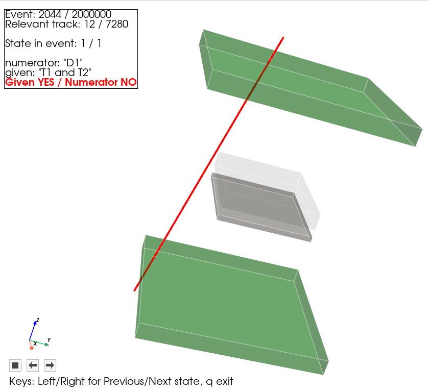
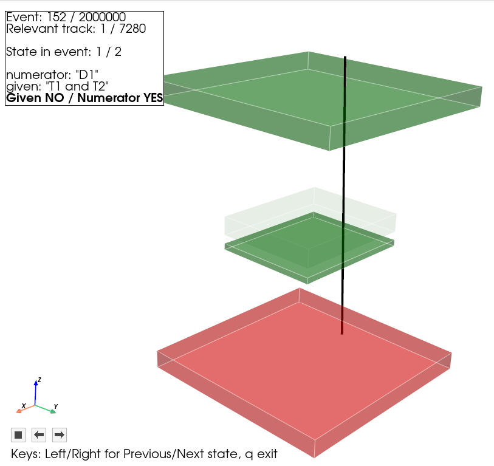

# Toy MC Particle Detector Stand: Acceptance, Rates and Efficiencies

<p align="center">
  
  
  
  
</p>

<table align="center">
  <tr>
    <td align="center">
      <strong>Toy Monte Carlo for cosmic-ray stands</strong><br>
      A geometric Monte Carlo for estimating cosmic ray stand acceptance, trigger rates, and detector efficiencies.
    </td>
  </tr>
</table>


<p align="center">
  
  <br>
  <em>A cosmic-ray track crossing two 10×10 cm² trigger scintillators (T1, T2)<br>and firing the
  6×5 cm² D1 detector. The central 6×5 cm² T3 scintillator (grey, transparent)<br>sits in the geometry but is
  not used by this particular logic configuration.</em>
</p>

<table align="center" width="600">
  <tr>
    <td align="center" width="33%"></td>
    <td align="center" width="33%"></td>
  </tr>
  <tr>
    <td align="center"><strong>Particle Beam</strong><br> setups</td>
    <td align="center"><strong>Radioactive Sources</strong><br></td>
  </tr>
</table>


> [!IMPORTANT]
> The current engine is intentionally geometric and simple.
> It does not simulate energy loss, material interactions, multiple scattering, secondaries, pileup or timing requirements. It's not GEANT4.

> [!NOTE]
> **AI disclaimer**
> This is a personal project I built mainly to learn how to code with AI assistance.
> I used AI heavily throughout the development process, especially because I had no prior Python experience.
> For me, AI was a tool that made this project possible.

## Quick Start

Clone or copy the repository, then run one of these:

```bash
./run_toymc.sh configs/example_cosmic.yaml                       # only terminal output
./run_toymc.sh configs/example_cosmic.yaml --gui --geometry-only # view detector geometry
./run_toymc.sh configs/example_cosmic.yaml --gui --event-display # view particle tracks
```

You can also change source type:
```bash
configs/example_beam.yaml   # horizontal particle beam
configs/example_object.yaml # radioactive source
```

## Table of Contents

- [What It Does](#what-it-does)
- [How To Run](#how-to-run)
- [GUI Modes](#gui-modes)
- [Configuration](#configuration)
- [Logic and Conditionals](#logic-and-conditionals)
- [GUI Colors and Track States](#gui-colors-and-track-states)
- [Manual Venv Setup](#manual-venv-setup)
- [Tests](#tests)
- [Notes](#notes)

## What It Does

The current implementation is a geometric toy Monte Carlo engine with an
optional GUI layer. It:

- reads a YAML configuration file
- generates straight cosmic-ray tracks
- computes detector crossings
- applies detector efficiencies
- prints detector rates, logic rates, and conditional probabilities
- optionally opens a 3D detector viewer or a relevant-track event display

## How To Run

The main entry point is:

```bash
./run_toymc.sh configs/example_cosmic.yaml
```

On the first run, the script will:

- create `.venv/` in the repository root
- install dependencies from `requirements.txt`
- run the local CLI from this checkout

Later runs reuse the same environment unless `requirements.txt` changes.

<details>
<summary><strong>Expected headless output</strong></summary>

```text
$ ./run_toymc.sh configs/example_cosmic.yaml
Progress: 2000000 / 2000000 (100.00%)
Seed: 123456
Generated events: 2000000  (A_gen = 61600.180 cm^2)

Detector rates:
  det  geometric           fired
  T1   1.121 +/- 0.019 Hz  0.902 +/- 0.017 Hz
  T3   0.349 +/- 0.010 Hz  0.288 +/- 0.009 Hz
  D1   0.318 +/- 0.010 Hz  0.318 +/- 0.010 Hz
  T2   1.142 +/- 0.019 Hz  0.921 +/- 0.017 Hz

Logic expressions:
  T1 and T2
    geometric: 0.152 +/- 0.007 Hz
    fired:     0.099 +/- 0.006 Hz
  T1 and T2 and T3
    geometric: 0.087 +/- 0.005 Hz
    fired:     0.048 +/- 0.004 Hz

Conditional probabilities:
  D1|T1*T2
    fired:     0.570 +/- 0.028 (n_cond=321)
    geometric: 0.564 +/- 0.022 (n_cond=495)
  D1|T1*T2*T3
    fired:     0.949 +/- 0.018 (n_cond=156)
    geometric: 0.950 +/- 0.013 (n_cond=281)
```

</details>

## GUI Modes

### Geometry Only

```bash
./run_toymc.sh configs/example_cosmic.yaml --gui --geometry-only
```

This opens a rotatable 3D view of the detector geometry without running the
Monte Carlo.

### Event Display

```bash
./run_toymc.sh configs/example_cosmic.yaml --gui --event-display
```

This runs the simulation once and then shows only relevant tracks.

- left/right arrow keys step backward or forward
- `q` or `Escape` closes the viewer
- a track is relevant when at least one conditional `given` expression is true
  in geometric mode for that event
- if one track is relevant for more than one conditional, the GUI cycles
  through those conditionals before moving to the next relevant track
- detector colors mean:
  - green: crossed and fired
  - red: crossed and not fired
  - base color: not crossed
- if `logic.conditional` is empty, event-display mode exits with a clear
  message
- if no relevant tracks are found, event-display mode exits with a clear
  message

<table align="center" width="600">
  <tr>
    <td align="center" width="33%"></td>
    <td align="center" width="33%"></td>
    <td align="center" width="33%"></td>
  </tr>
  <tr>
    <td align="center"><strong>Given YES / Numerator YES</strong><br>T1 and T2 both fire (given), and D1 also fires (numerator): a fully confirmed coincidence.</td>
    <td align="center"><strong>Given YES / Numerator NO</strong><br>T1 and T2 fire the trigger, but D1 misses: an inefficiency in the small detector.</td>
    <td align="center"><strong>Given NO / Numerator YES</strong><br>T2 fails to fire so the trigger condition is false, yet D1 still fires: an edge case where the numerator is true even though its given condition is not.</td>
  </tr>
</table>

## Configuration

The engine is configured through YAML.

<details>
<summary><strong>Minimal field overview</strong></summary>

- `seed`: fixed integer seed, or `null` to derive it from local time
- `source_model`: particle source; one of `cosmic`, `beam`, or `object` (see
  below)
- `monte_carlo.n_events`: number of generated events
- `detectors`: list of detector volumes
- `logic.expressions`: boolean detector expressions to evaluate as rates
- `logic.conditional`: conditional probabilities to report
- `output`: CLI formatting settings
- `gui`: optional GUI-only settings

</details>

<details>
<summary><strong>Detector fields</strong></summary>

Each detector entry must contain:

- `name`: unique detector name used in logic expressions
- `center`: `[x, y, z]`
- `size`: `[dx, dy, dz]`
- `efficiency`: number between `0` and `1`

</details>

<details>
<summary><strong>Source models</strong></summary>

`source_model.type` selects one of three particle sources. Only one source
is active per run.

**`cosmic`** — downward cosmic-ray-like flux, sampled from a `cos^2(theta)`
zenith-angle distribution over a flat plane above the detector stack:

```yaml
source_model:
  type: cosmic
  model: cos2           # only supported model today
  theta_max_deg: 70     # 0 < theta_max_deg < 90
  flux_hz_per_cm2: 0.01 # total downward flux over the simulated cone
```

**`beam`** — a directed beam traveling in `+z` (`z` increases going
downstream, entering from the detector stack's lowest-`z` face), with a
transverse spatial profile:

```yaml
source_model:
  type: beam
  profile: uniform      # uniform | gaussian (divergence is rejected: not yet implemented)
  center: [0.0, 0.0]    # xc, yc
  size: [8.0]           # uniform: [diameter]; gaussian: [FWHM_x, FWHM_y]
  flux_hz_per_cm2: 50.0 # uniform: the flux; gaussian: average over the FWHM ellipse
```

Selecting `beam` also changes the GUI's default startup view: the `yz`
plane becomes the horizontal ground plane (beam entering from the side)
with `x` pointing up, instead of the usual `z`-up view.

**`object`** — a radioactive point/volume source emitting isotropically
over the full 4*pi sphere from a random point inside the volume:

```yaml
source_model:
  type: object
  shape: sphere           # sphere | disk | box
  center: [0.0, 0.0,20.0] # xc, yc, zc
  size: [2.0]             # sphere: [diameter]; disk: [diameter_xy, wz]; box: [wx, wy, wz]
  activity_hz: 100000.0   # total emission rate
```

`object` sources are rendered in the GUI using `gui.source_color` /
`gui.source_opacity` (defaults: `orange`, `0.25`).

</details>


## Logic and Conditionals

<details>
<summary><strong>How to setup the trigger and detector logic </strong></summary>

Allowed expression syntax:

- detector names such as `T1`, `T2`, `D1`
- `and`
- `or`
- `not`
- parentheses

Short example:

```yaml
logic:
  expressions:
    - "T1 and T2"
    - "T1 and T2 and not D1"
```

Conditionals use the same expression syntax:

```yaml
logic:
  conditional:
    - name: "D1|T1*T2"
      numerator: "D1"
      given: "T1 and T2"
```

The engine reports each conditional in both modes:

- `geometric`: evaluated on detector crossings
- `fired`: evaluated on detector firing booleans

</details>

## GUI Colors and Track States

<details>
<summary><strong>GUI color fields</strong></summary>

Supported GUI fields:

- `background_color`
- `default_detector_color`
- `detector_colors`
- `default_track_color`
- `track_color_geometric_only`
- `track_color_fired_given_only`
- `track_color_fired_joint`
- `line_width`

Color values can be written as:

- named colors such as `black`, `lightgray`, `orange`, `lime`
- hex strings such as `"#ff8800"`
- RGB triples such as `[0.2, 0.6, 1.0]`

</details>

<details>
<summary><strong>What the three track-color fields mean</strong></summary>

In event-display mode, the currently shown track color is chosen from these
three fields according to the conditional state being displayed:

- `track_color_geometric_only`
  - use this when the conditional `given` is true geometrically
  - but the same `given` is false in fired mode
- `track_color_fired_given_only`
  - use this when the conditional `given` is true in fired mode
  - but the conditional `numerator` is false
- `track_color_fired_joint`
  - use this when both the conditional `given` and `numerator` are true in
    fired mode

So when the README says “the track color depends on the currently shown
conditional state”, it means the GUI picks one of these three config fields for
the specific `(track, conditional)` view currently on screen.

</details>

## Manual Venv Setup

<details>
<summary><strong>Prepare the same local environment manually</strong></summary>

```bash
python3 -m venv .venv
source .venv/bin/activate
pip install -r requirements.txt
```

If you already activated that environment yourself, you can also run:

```bash
python3 scripts/run_toymc.py configs/example_cosmic.yaml
```

</details>

## Tests

<details>
<summary><strong>Run the test suite</strong></summary>

```bash
PYTHONPATH=src .venv/bin/python -m unittest discover -s tests -v
```

</details>
